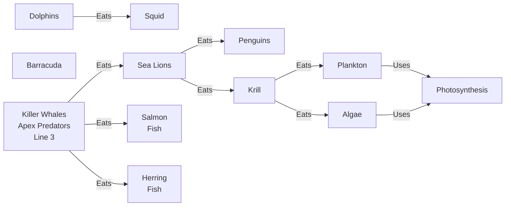

```mermaid
flowchart LR
  killerwhale[Killer Whales<br>Apex Predators<br>Line 3]
  seal[Sea Lions]
  barracuda[Barracuda]
  dolphin[Dolphins]
  
  squid[Squid]
  penguin[Penguins]
  krill[Krill]
  
  salmon[Salmon<br>Fish]
  herring[Herring<br>Fish]
  
  %%Plants
  plankton[Plankton]
  algae[Algae]
  
  photosyn[Photosynthesis]
    
  plankton -- Uses --> photosyn
  algae -- Uses --> photosyn
  
  
  %% First Stage
  krill -- Eats --> plankton
  krill -- Eats --> algae
  

  
  killerwhale -- Eats --> seal
  killerwhale -- Eats --> salmon
  killerwhale -- Eats --> herring
  
    
  dolphin -- Eats --> squid 
  seal -- Eats --> penguin
  seal -- Eats --> krill
  
  
  

```
