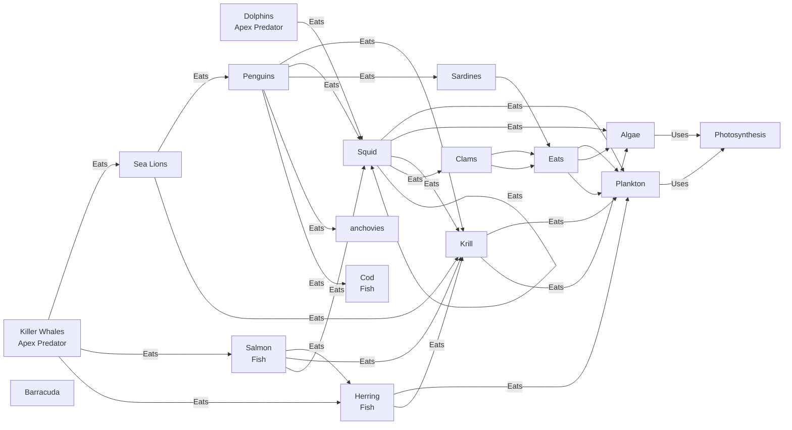

```mermaid
flowchart LR
  killerwhale[Killer Whales<br>Apex Predator]
  seal[Sea Lions]
  barracuda[Barracuda]
  dolphin[Dolphins<br>Apex Predator]
  
  squid[Squid]
  penguin[Penguins]
  krill[Krill]
  clam[Clams]

  sardine[Sardines]
  cod[Cod<br>Fish] 
  salmon[Salmon<br>Fish]
  herring[Herring<br>Fish]
  
  %%Plants
  plankton[Plankton]
  algae[Algae]
  
  photosyn[Photosynthesis]
    
  plankton -- Uses --> photosyn
  algae -- Uses --> photosyn
  
  
  %% First Stage
  krill -- Eats --> plankton
  krill -- Eats --> algae
  
  clam --> Eats --> plankton
  clam --> Eats --> algae
  
  sardine --> Eats --> plankton
  
  squid -- Eats --> plankton
  squid -- Eats --> algae
  squid -- Eats --> krill
  squid -- Eats --> clam
  squid -- Eats --> squid
    
  killerwhale -- Eats --> seal
  killerwhale -- Eats --> salmon
  killerwhale -- Eats --> herring
  
  penguin -- Eats --> krill
  penguin -- Eats --> squid
  penguin -- Eats --> sardine
  penguin -- Eats --> anchovies
  penguin -- Eats --> cod
      
  dolphin -- Eats --> squid 
  
  salmon -- Eats --> herring
  salmon -- Eats --> krill
  salmon -- Eats --> squid
  
  seal -- Eats --> penguin
  seal -- Eats --> krill
  
  herring -- Eats --> plankton
  herring -- Eats --> krill
  
  
  

```
