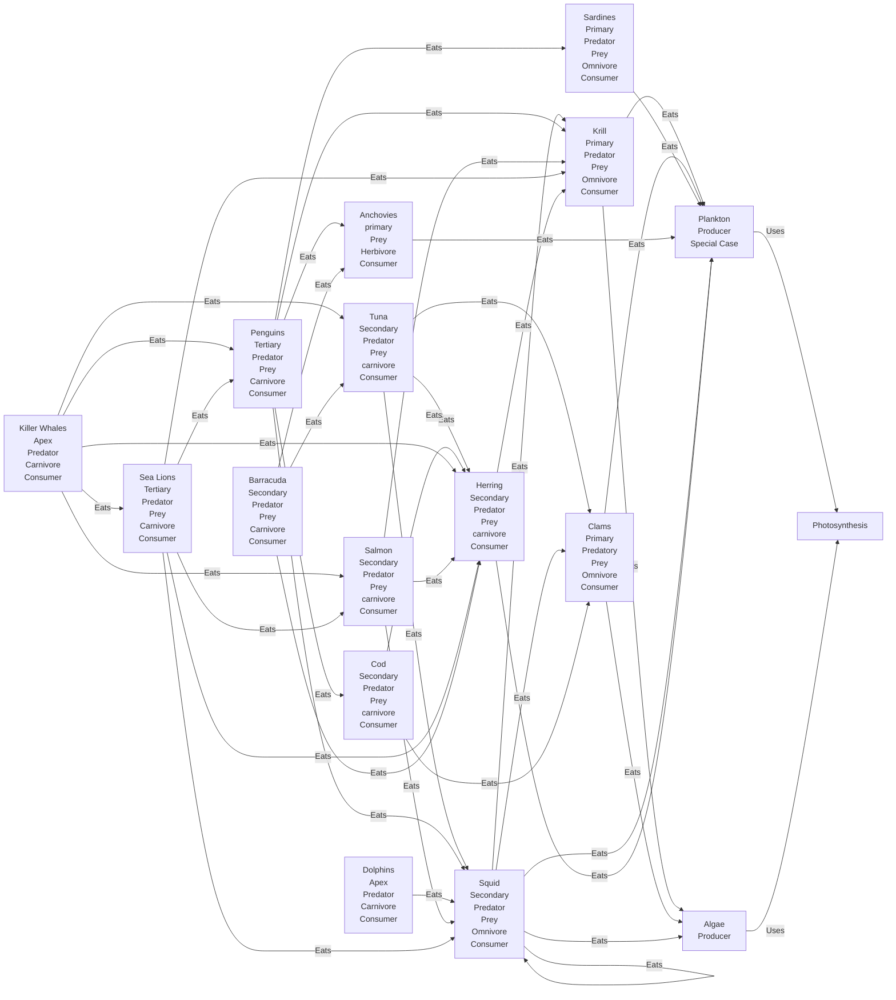

```mermaid
flowchart LR
  killerwhale[Killer Whales<br>Apex<br>Predator<br>Carnivore<br>Consumer]
  seal[Sea Lions<br>Tertiary<br>Predator<br>Prey<br>Carnivore<br>Consumer]
  barracuda[Barracuda<br>Secondary<br>Predator<br>Prey<br>Carnivore<br>Consumer]
  dolphin[Dolphins<br>Apex<br>Predator<br>Carnivore<br>Consumer]
  
  squid[Squid<br>Secondary<br>Predator<br>Prey<br>Omnivore<br>Consumer]
  penguin[Penguins<br>Tertiary<br>Predator<br>Prey<br>Carnivore<br>Consumer]
  krill[Krill<br>Primary<br>Predator<br>Prey<br>Omnivore<br>Consumer]
  clam[Clams<br>Primary<br>Predatory<br>Prey<br>Omnivore<br>Consumer]

  sardine[Sardines<br>Primary<br>Predator<br>Prey<br>Omnivore<br>Consumer]
  cod[Cod<br>Secondary<br>Predator<br>Prey<br>carnivore<br>Consumer] 
  salmon[Salmon<br>Secondary<br>Predator<br>Prey<br>carnivore<br>Consumer]
  herring[Herring<br>Secondary<br>Predator<br>Prey<br>carnivore<br>Consumer]
  tuna[Tuna<br>Secondary<br>Predator<br>Prey<br>carnivore<br>Consumer]
  
  anchovie[Anchovies<br>primary<br>Prey<br>Herbivore<br>Consumer]
  
  %%Plants
  plankton[Plankton<br>Producer<br>Special Case]
  algae[Algae<br>Producer]
  
  photosyn[Photosynthesis]
    
  plankton -- Uses --> photosyn
  algae -- Uses --> photosyn
  
  
  %% First Stage
  krill -- Eats --> plankton
  krill -- Eats --> algae
  
  clam -- Eats --> plankton
  clam -- Eats --> algae
  
  sardine -- Eats --> plankton
  anchovie -- Eats --> plankton
  
  tuna -- Eats --> squid
  tuna -- Eats --> herring
  tuna -- Eats --> clam
  
  squid -- Eats --> plankton
  squid -- Eats --> algae
  squid -- Eats --> krill
  squid -- Eats --> clam
  squid -- Eats --> squid
  
  cod -- Eats --> herring
  cod -- Eats --> clam
    
  killerwhale -- Eats --> seal
  killerwhale -- Eats --> salmon
  killerwhale -- Eats --> herring
  killerwhale -- Eats --> tuna
  killerwhale -- Eats --> penguin
  
  penguin -- Eats --> krill
  penguin -- Eats --> squid
  penguin -- Eats --> sardine
  penguin -- Eats --> anchovie
  penguin -- Eats --> cod
      
  dolphin -- Eats --> squid 
  
  salmon -- Eats --> herring
  salmon -- Eats --> krill
  salmon -- Eats --> squid
  
  seal -- Eats --> penguin
  seal -- Eats --> krill
  seal -- Eats --> herring
  seal -- Eats --> squid
  seal -- Eats --> salmon
  
  herring -- Eats --> plankton
  herring -- Eats --> krill
  
  barracuda -- Eats --> anchovie
  barracuda -- Eats --> herring
  barracuda -- Eats --> tuna
  
  

```
